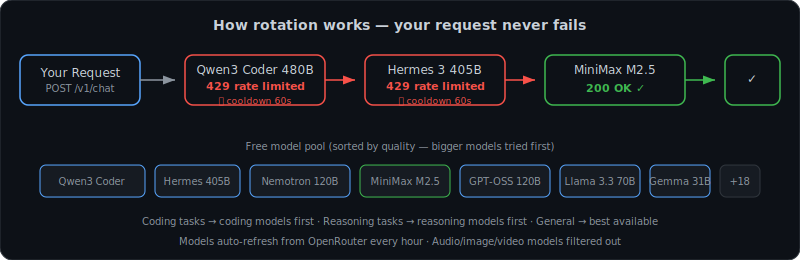

<div align="center">

# always-llm

**Free LLMs that never fail.**

One OpenRouter key. 25+ free models. Zero 429s. Automatic rotation.

[](https://deploy.workers.cloudflare.com/?url=https://github.com/Kart-ing/all-llm)
&nbsp;&nbsp;
[](https://vercel.com/new/clone?repository-url=https://github.com/Kart-ing/all-llm)

[](LICENSE)
[](tsconfig.json)
[](https://workers.cloudflare.com)

<br/>

[Simple Setup](#simple-setup) · [How It Works](#how-it-works) · [Works With](#works-with) · [Deep Dive](#deep-dive) · [API Reference](#api-reference)

</div>

---

## The Problem

You're vibe coding. You're in the zone. Then:

```
Error: 429 Too Many Requests
```

Your free model hit its rate limit. Maybe it's your app — the chatbot you vibe-coded last weekend, the AI feature you shipped on a free tier. Maybe it's your IDE. Either way, your flow is gone. You Google for another free model, swap the config, and 10 minutes later it happens again.

**always-llm fixes this.** It's an OpenAI-compatible proxy that sits between your project (or your tools) and OpenRouter. When a model says "too many requests," it silently tries the next free model. And the next. And the next. Your app stays up. Your IDE keeps working. You never see the error.

<div align="center">
<br/>

<br/><br/>
</div>

---

## Simple Setup

Three steps. Under 60 seconds.

### 1. Get a free OpenRouter key

Go to **[openrouter.ai/keys](https://openrouter.ai/keys)** → Sign up → Create API key → Copy it (`sk-or-v1-...`)

### 2. Deploy

Click a button above, or:

```bash
git clone https://github.com/Kart-ing/all-llm && cd all-llm && npm i
npx wrangler secret put OPENROUTER_API_KEY   # paste your key
npx wrangler deploy                          # done
```

### 3. Use it

Your deployed URL is your new OpenAI-compatible base URL:

```
https://always-llm.YOUR-NAME.workers.dev/v1
```

**In your project** — drop it in anywhere you'd use the OpenAI SDK. Your vibe-coded app gets free, reliable LLM calls without ever hitting a rate limit:

```ts
const client = new OpenAI({
  apiKey: "sk-or-...",
  baseURL: "https://always-llm.YOUR-NAME.workers.dev/v1",
});
```

**In your IDE** — also works as the backend for Cursor, Claude Code, Cline, or any OpenAI-compatible coding tool. Swap the base URL and keep vibing.

> [!IMPORTANT]
> **This is 100% self-hosted.** It deploys to YOUR Cloudflare or Vercel account. Your API key stays on YOUR infrastructure. We never see it, store it, or touch it.

That's it. Go vibe. Your LLMs will never fail again.

---

## How It Works

```
                    ┌──────────────────────┐
  Your request  ──▶ │     always-llm       │
                    │                      │
                    │  1. Detect task type  │
                    │  2. Pick best model   │──▶  OpenRouter  ──▶  Response
                    │  3. If 429 → rotate   │
                    │  4. Never fail        │
                    └──────────────────────┘
```

**On startup** — fetches the full model list from OpenRouter, filters to free text-only models, ranks them by quality (bigger = better), caches for 1 hour.

**On each request** — detects what you're doing (coding? reasoning? creative?) and picks the best free model for that task. If it 429s, tries the next one. If that 429s, tries the next. All the way down the list.

**You see:** a normal response, every time.

### Smart Task Routing

Your prompts are automatically analyzed. The right specialist model gets picked first.

| Task | Triggers | Models tried first |
|---|---|---|
| **Coding** | Code blocks, programming keywords, `function`, `debug`, `implement` | Qwen3 Coder 480B, GPT-OSS 120B |
| **Reasoning** | `step by step`, math, `analyze`, `prove`, `calculate` | LFM-Thinking, DeepSeek R1 |
| **Creative** | `story`, `poem`, `imagine`, fiction, roleplay | Dolphin/Venice |
| **General** | Everything else | All models, best quality first |

> [!NOTE]
> Task detection is automatic but you can override it with the `x-always-llm-task: coding` header or by prefixing the model: `coding:meta-llama/llama-3.3-70b-instruct:free`

### Quality Ranking

Within each tier, models are sorted by quality score:

```
score = 0.7 × log₂(params) + 0.3 × log₂(context_window)
```

Bigger, smarter models are tried first. A 480B MoE model beats a 70B dense model, which beats a 12B model. You always get the best available free model for your task.

---

## Works With

| Tool | Setup |
|---|---|
| **Claude Code** | [`examples/claude-code.md`](examples/claude-code.md) — set `OPENAI_BASE_URL` env var |
| **Cursor** | Settings → Models → Override OpenAI Base URL |
| **Cline** | Settings → OpenAI Compatible → Base URL |
| **Continue.dev** | [`examples/cline.md`](examples/cline.md) — config snippet included |
| **OpenAI SDK** | Set `baseURL` to your deployed URL + `/v1` |
| **Vercel AI SDK** | Drop-in via `@ai-sdk/openai` with custom `baseURL` |
| **cURL** | Just hit the endpoint |
| **Anything OpenAI-compatible** | If it has a base URL field, it works |

### Quick Example (OpenAI SDK)

```ts
import OpenAI from "openai";

const client = new OpenAI({
  apiKey: "sk-or-...",                                    // your OpenRouter key
  baseURL: "https://always-llm.yourname.workers.dev/v1", // your deployed URL
});

const res = await client.chat.completions.create({
  model: "meta-llama/llama-3.3-70b-instruct:free",
  messages: [{ role: "user", content: "hello" }],
});
// If Llama is rate-limited, you still get a response — from whichever model was available.
// Check res.headers['x-always-llm-model'] to see which one served it.
```

---

## Why always-llm?

<div align="center">
<br/>

<br/>
<em>Your app → always-llm → OpenRouter → the actual model. It's proxies all the way down.</em>
<br/><br/>
</div>

| | **always-llm** | Raw OpenRouter | [Mirrowel/LLM-API-Key-Proxy](https://github.com/Mirrowel/LLM-API-Key-Proxy) |
|---|---|---|---|
| Auto-rotation on 429 | ✅ | ❌ | ✅ |
| Task-based routing | ✅ | ❌ | ❌ |
| Quality-ranked rotation | ✅ | ❌ | ❌ |
| One-click deploy | ✅ Workers + Vercel | — | ❌ self-host Docker |
| Multi-provider | ✅ one key, all providers | ✅ | ✅ separate keys |
| Setup time | **~60 seconds** | ~5 min | ~30 min |
| Config surface | **zero** | zero | YAML + keys per provider |

---

<details>
<summary><h2>Deep Dive</h2></summary>

### Rotation Mechanics

1. **Fetch** — On first request (then cached 1hr), GET `https://openrouter.ai/api/v1/models`. Filter: `pricing.prompt == "0"` AND `pricing.completion == "0"` AND `output_modalities == ["text"]`. Exclude `openrouter/free` (we are the router).
2. **Rank** — Extract parameter count from model IDs (handles MoE patterns like `480B-A35B`). Score by `0.7 × log₂(size) + 0.3 × log₂(context)`. Sort descending.
3. **Route** — Detect task from messages. Build rotation: preferred model → task-matched models (best first) → all others (best first). Skip models on cooldown.
4. **Try** — Call OpenRouter. If response is `402`, `429`, `502`, `503`, or `504`: put model on 60s cooldown, try next. If `400` or `401`: return error to caller (that's your problem, not a rate limit).
5. **Stream** — If `stream: true`, we only rotate on the initial HTTP status. Once SSE bytes start flowing, we can't switch mid-stream — the client already has half a response from one model. This is a deliberate constraint, not a bug.

### Cooldown System

- In-memory `Map<modelId, cooldownUntilMs>`. Simple, fast, good enough for v0.1.
- Different Cloudflare Worker isolates have independent cooldown maps. This is fine — at free-tier traffic levels you're usually hitting the same isolate.
- v0.2 will use Cloudflare KV for global cooldowns.

### Modality Filtering

Not all "free" models are useful for chat. Lyria (Google's music model) is free but outputs audio. Image generators are free but don't respond to text prompts sensibly. We filter `output_modalities` to `["text"]` only.

### Fallback List

If OpenRouter's `/models` endpoint is down, we fall back to a hardcoded list of 21 known-free models (updated April 2026). This list is cached for only 5 minutes so we retry the live endpoint quickly.

### Size Extraction

Model IDs follow patterns: `meta-llama/llama-3.3-70b-instruct:free` → 70B. MoE models: `qwen/qwen3-coder-480b-a35b:free` → 480B total. For models without sizes in their ID (MiniMax, Elephant), we maintain a `KNOWN_SIZES` override map.

</details>

---

## API Reference

### `POST /v1/chat/completions`

OpenAI-compatible. `model` is a preference — rotation may use a different one.

**Response headers:**
| Header | Description |
|---|---|
| `x-always-llm-model` | Which model actually served the request |
| `x-always-llm-task` | Detected task: `coding`, `reasoning`, `creative`, `general` |

**Request headers (optional):**
| Header | Description |
|---|---|
| `x-always-llm-task` | Force a task category (overrides auto-detection) |

**Model prefix syntax:** `coding:model-id`, `reasoning:model-id`, `creative:model-id` — prefix stripped before forwarding.

### `GET /v1/models`

Returns free text-output models, sorted by quality score. Each model includes `_always_llm.size_b` and `_always_llm.quality_score`.

### Authentication

`Authorization: Bearer sk-or-...` header, or set `OPENROUTER_API_KEY` as a Worker secret for keyless client access.

---

## Local Dev

```bash
cp .dev.vars.example .dev.vars     # add your OPENROUTER_API_KEY
npm run dev                        # wrangler dev on :8787
npm run build                      # tsc --noEmit (strict mode, zero errors)
```

---

## Roadmap

| Version | Status | What |
|---|---|---|
| v0.1.0 | ✅ | In-memory cooldown, round-robin rotation |
| v0.1.1 | ✅ | Task-based smart routing, Claude Code integration |
| v0.1.2 | ✅ **current** | Quality-ranked models, modality filtering, live model list |
| v0.2 | planned | Cloudflare KV-backed cooldowns (shared across isolates) |
| v0.3 | planned | Per-model latency tracking, prefer-fastest routing |
| v0.4 | maybe | Bring-your-own-provider (Gemini direct, Groq) |

---

<div align="center">

MIT License · Built for vibe coders

</div>
